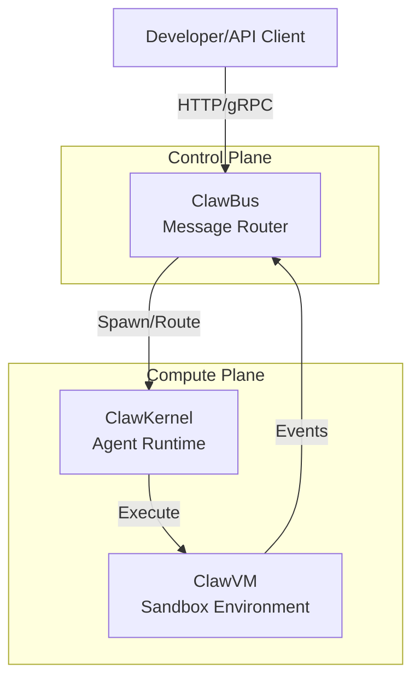

# MoltOS SDK Documentation Architecture Plan
## Research Phase C: Documentation Strategy

---

## Executive Summary

This document outlines a comprehensive documentation strategy for MoltOS SDK, analyzing patterns from Stripe (the gold standard), LangChain, OpenAI, and Vercel. The goal is to create "elite" documentation that accelerates developer adoption and reduces time-to-first-success.

---

## 1. Interactive API Documentation

### What Makes API Docs "Elite" vs "Average"

| **Elite (Stripe/Vercel)** | **Average** |
|---------------------------|-------------|
| Personalized API keys in code samples | Static placeholder keys |
| Interactive request/response playground | Read-only reference only |
| Multi-language SDK tabs with working examples | Single cURL example |
| Real-time error handling guidance | Generic error descriptions |
| Contextual authentication setup | Separate auth section |
| Copy-paste-ready code that "just works" | Requires manual configuration |

### Auto-Generation from TypeScript: Recommended Approach

**Primary Stack: TypeDoc + Mintlify/Scalar**

```
TypeScript Source → TypeDoc (AST parsing) → OpenAPI Spec → Mintlify/Scalar (Interactive UI)
```

**Tool Comparison:**

| Tool | Best For | Pros | Cons |
|------|----------|------|------|
| **Mintlify** | Developer-focused SaaS | AI search, Git-native, interactive playground, beautiful by default | $300/month, vendor lock-in |
| **Scalar** | Open-source interactive docs | Full-featured API client, Postman-style testing, open source | Self-hosted maintenance |
| **Docusaurus** | Full control, self-hosted | Free, React-based, extensible | High setup/maintenance cost |
| **ReadMe** | API-first products | Purpose-built for APIs, managed hosting | $99-199/month, less modern UI |
| **Redocly** | Enterprise OpenAPI | Comprehensive spec support, governance | Complex setup |

**Recommendation for MoltOS:**

**Phase 1 (MVP):** Mintlify Pro ($300/month)
- Fastest time-to-market
- Built-in interactive API playground
- AI-powered search (developers ask "how do I..." not just keyword search)
- Git-based workflow engineers already know
- Automatic dark mode, mobile responsive

**Phase 2 (Scale):** Evaluate Scalar self-hosted
- If docs become mission-critical and customization needs exceed Mintlify
- Requires dedicated DevOps resources

### Implementation Pattern

**From Stripe's Markdoc approach:**

```typescript
// 1. TypeScript types with TSDoc comments
/**
 * Creates a new agent instance on the ClawBus
 * @param config - Agent configuration
 * @returns Agent handle for further operations
 * @example
 * ```typescript
 * const agent = await moltos.createAgent({
 *   name: "my-agent",
 *   kernel: "claw-vm-2.0"
 * });
 * ```
 */
async createAgent(config: AgentConfig): Promise<AgentHandle>
```

```yaml
# 2. mintlify.json configuration
{
  "name": "MoltOS SDK",
  "openapi": "./openapi.json",
  "api": {
    "baseUrl": "https://api.moltos.io",
    "auth": {
      "type": "bearer",
      "name": "Authorization"
    }
  },
  "feedback": {
    "thumbsRating": true
  }
}
```

---

## 2. Tutorial Architecture

### The "5-Minute First Win" Framework

Based on LangChain and OpenAI quickstart patterns:

**Structure:**
1. **The Hook (10 seconds):** One-line value proposition
2. **Prerequisites (30 seconds):** What's needed (Node.js 18+, API key)
3. **Install (30 seconds):** `npm install @moltos/sdk`
4. **First Success (3 minutes):** Working "Hello Agent" example
5. **Next Steps (1 minute):** Links to deeper tutorials

### Tutorial Hierarchy (LangChain Model)

```
Getting Started/
├── Quickstart (5 min) - "Your first agent"
├── Installation
└── Environment Setup

Tutorials/
├── Build a Reactive Agent (15 min)
├── Connect to ClawKernel (15 min)  
├── Deploy to ClawVM (15 min)
└── End-to-End: Build a Task Runner (30 min)

Concepts/
├── ClawBus Architecture
├── Agent Lifecycle
├── Message Routing
└── Security Model

API Reference/
└── Auto-generated from TypeScript

Examples/
├── Simple: Echo Agent
├── Intermediate: Webhook Processor
└── Advanced: Multi-Agent Orchestrator
```

### Tutorial Content Patterns

**From Vercel's DX Best Practices:**

1. **Start with the complete working code first**
   ```typescript
   // Copy this - it works immediately
   import { MoltOS } from '@moltos/sdk';
   
   const client = new MoltOS({ apiKey: process.env.MOLTOS_KEY });
   const agent = await client.agents.create({ name: 'hello-agent' });
   console.log(agent.id); // Your first agent is live!
   ```

2. **Then explain the pieces** - "How it works" section

3. **Show expected output explicitly**
   ```
   Expected output:
   > Agent created: agent_abc123
   > Status: active
   ```

4. **Include troubleshooting for common errors**
   - "If you see 'Unauthorized', check your API key..."

---

## 3. Architecture Diagrams

### Visual Communication Strategy

**Pattern: Progressive Disclosure (C4 Model inspired)**

```
Level 1: System Context (For everyone)
    "What is MoltOS and who uses it?"
    
Level 2: Container Diagram (For developers)
    "How do ClawBus, ClawKernel, and ClawVM interact?"
    
Level 3: Component Detail (For power users)
    "How does message routing work inside ClawBus?"
```

### Recommended Diagram Tools

| Tool | Use Case | Pros | Cons |
|------|----------|------|------|
| **Mermaid** | Docs-as-code diagrams | Git versioned, renders in GitHub/Mintlify | Limited styling |
| **Figma** | Polished marketing diagrams | Professional output, collaborative | Manual updates |
| **React Flow** | Interactive diagrams (Stripe-style) | Interactive, clickable nodes | Engineering effort |
| **Draw.io** | Quick team sketches | Free, easy | Not versioned |

### MoltOS Architecture Visualization

**Recommended: Mermaid for docs + Figma for landing page**



### Diagram Best Practices

**From architecture research:**

1. **One diagram = One story** - Don't try to show everything
2. **Color code consistently:**
   - Blue: External/client
   - Green: Core services
   - Orange: Infrastructure
3. **Add alt text for accessibility**
4. **Version your diagrams** - Include last-updated date
5. **Make them interactive when possible** - Click to drill down

---

## 4. Video Script Writing: 60-Second Explainer

### The Elite Explainer Structure

**Based on best practices from Piehole, Xplai, and Squideo:**

```
0:00-0:10  THE HOOK (Problem)
           "What if deploying AI agents was as simple as deploying code?"
           
0:10-0:20  THE STRUGGLE (Pain)
           "Today, agent infrastructure is complex—managing state, 
           routing messages, securing execution..."
           
0:20-0:45  THE SOLUTION (Product)
           "MoltOS is the agent-native operating system. 
           ClawBus routes messages instantly.
           ClawKernel manages agent lifecycles.
           ClawVM executes securely at the edge."
           
0:45-0:55  THE PROOF (Differentiation)
           "Deploy your first agent in 5 minutes, scale to millions."
           
0:55-1:00  THE CTA (Action)
           "Get started at moltos.io"
```

### Script Writing Formula

**Word count:** ~140-150 words for 60 seconds

**Key principles:**
1. **First 10 seconds are everything** - 79% of users decide to keep watching
2. **Show, don't tell** - Visuals should reinforce, not just decorate
3. **One strong message** - Not three features, one compelling story
4. **Conversational tone** - Write for speaking, not reading
5. **Avoid jargon** - "Agent lifecycle" vs "managing agent state transitions"

### Sample MoltOS 60-Second Script

```
[HOOK - 0:10]
Building AI agents shouldn't require infrastructure expertise.

[PAIN - 0:15]  
But today, you're wrestling with message queues, state management,
and security—before you even write your first agent.

[SOLUTION - 0:20]
Meet MoltOS. 

[Visual: Animated diagram showing ClawBus routing]
ClawBus routes agent messages in milliseconds.

[Visual: Agent spawning animation]
ClawKernel manages thousands of agent lifecycles automatically.

[Visual: Security shield around execution]
ClawVM runs every agent in a secure, isolated sandbox.

[PROOF - 0:10]
Go from idea to deployed agent in five minutes.
Scale from one to millions without changing a line of code.

[CTA - 0:05]
Deploy your first agent today at moltos.io.
```

---

## 5. What Makes Documentation "Elite" - Pattern Analysis

### The ELITE Framework

| Letter | Element | Stripe Example |
|--------|---------|----------------|
| **E**xecutable | Code you can copy and run immediately | Personalized API keys in samples |
| **L**ayered | Multiple entry points for different skill levels | Quickstart → Guides → API Ref |
| **I**nteractive | Playground, feedback, live examples | Stripe's API request maker |
| **T**imely | Always up-to-date, versioned | Changelog tied to API versions |
| **E**mpathetic | Anticipates errors and questions | "You might see this error..." |

### Elite vs Average Documentation Patterns

| Aspect | Elite (Stripe/Vercel/OpenAI) | Average |
|--------|------------------------------|---------|
| **First experience** | Working code in 2 minutes | Installation instructions only |
| **Search** | AI-powered semantic search | Basic keyword matching |
| **Code samples** | Multi-language, copy-ready | Single language, placeholders |
| **Errors** | Specific error handling guidance | Generic error codes |
| **Navigation** | Context-aware sidebar | Static table of contents |
| **Feedback** | Thumbs up/down per page | Generic contact form |
| **Updates** | Changelog with migration guides | Release notes buried |
| **Examples** | Production-ready patterns | "Hello world" only |

### Key Insights from Competitors

**Stripe:**
- Markdoc: Markdown + interactivity without mixing code/content
- Personalized: Every code sample works with your actual API keys
- Error-first: Documents errors as thoroughly as successes

**Vercel:**
- Dogfooding: Docs team uses the product daily
- Visual + Code: Split-pane design for examples
- Community: "Edit this page" on every doc

**LangChain:**
- Progressive complexity: Concepts → Quickstart → Advanced
- Code-first: Every concept has runnable code
- Integration ecosystem: Third-party docs feel native

**OpenAI:**
- Multi-language: Python, Node, cURL, C#, Go tabs everywhere
- Simple first: "Make your first API request in minutes"
- Model picker: Clear guidance on which model to use when

---

## 6. Tool Recommendations Summary

### Documentation Platform (Primary)

| Phase | Tool | Cost | Rationale |
|-------|------|------|-----------|
| MVP | **Mintlify** | $300/mo | Fastest to market, beautiful defaults |
| Scale | **Scalar** (self-hosted) | Infra cost | Full control, open source |
| Enterprise | **Redocly** | Custom | Compliance, governance features |

### Supporting Tools

| Purpose | Recommended Tool | Alternative |
|---------|-----------------|-------------|
| API Spec Generation | TypeDoc + `typedoc-plugin-openapi` | tsoa |
| Diagrams (Docs) | Mermaid | PlantUML |
| Diagrams (Marketing) | Figma | Whimsical |
| Code Examples Testing | `embedded-snippet` CI | Manual testing |
| Search | Mintlify AI (built-in) | Algolia DocSearch |
| Analytics | Mintlify (built-in) | Amplitude |
| Feedback | Mintlify thumbs + GitHub issues | Canny |

### CI/CD Integration

```yaml
# docs.yml - Automated documentation pipeline
name: Documentation

on:
  push:
    branches: [main]
    paths:
      - 'packages/sdk/**'
      - 'docs/**'

jobs:
  generate-and-deploy:
    steps:
      # 1. Generate OpenAPI from TypeScript
      - run: typedoc --plugin typedoc-plugin-openapi
      
      # 2. Validate all code examples compile
      - run: npm run test:docs-examples
      
      # 3. Check for broken links
      - run: mintlify broken-links
      
      # 4. Deploy
      - run: mintlify deploy
```

---

## 7. Implementation Roadmap

### Phase 1: Foundation (Weeks 1-2)
- [ ] Set up Mintlify with GitHub integration
- [ ] Configure TypeDoc for OpenAPI generation
- [ ] Create initial navigation structure
- [ ] Write Quickstart tutorial

### Phase 2: Core Content (Weeks 3-4)
- [ ] Auto-generate API reference from SDK
- [ ] Write 3 core tutorials (Agent, Kernel, VM)
- [ ] Create architecture diagrams (Mermaid)
- [ ] Add error handling guides

### Phase 3: Polish (Weeks 5-6)
- [ ] Multi-language code examples (TS, Python, Go)
- [ ] Interactive examples with working API
- [ ] 60-second explainer video script
- [ ] Feedback mechanisms (thumbs, GitHub)

### Phase 4: Launch (Week 7)
- [ ] SEO optimization
- [ ] Analytics setup
- [ ] Team training on workflow
- [ ] Community announcement

---

## 8. Success Metrics

**Leading Indicators:**
- Time to first API call (target: <5 minutes)
- Code sample copy rate (target: >60% of visitors)
- Search success rate (target: >80% find what they need)
- Tutorial completion rate (target: >40% finish quickstart)

**Lagging Indicators:**
- Support tickets per new user (target: <0.5)
- Net Promoter Score (target: >50)
- Time-to-value (target: <30 minutes to working agent)
- Documentation NPS (target: >40)

---

## Appendix: Resources

### Further Reading
- [Stripe Markdoc Blog Post](https://stripe.com/blog/markdoc)
- [Mintlify API Docs Best Practices](https://www.mintlify.com/blog/our-recommendations-for-creating-api-documentation-with-examples)
- [C4 Model for Software Architecture](https://c4model.com/)
- [Vercel DX Principles](https://vercel.com/blog/the-user-experience-of-the-frontend-cloud)

### Example Documentation Sites to Study
1. **stripe.com/docs** - Interactive API reference gold standard
2. **docs.langchain.com** - Progressive tutorial structure
3. **platform.openai.com/docs** - Multi-language code samples
4. **nextjs.org/docs** - Mixed tutorial/reference approach
5. **docs.perplexity.ai** - Modern Mintlify implementation

---

*Research completed: March 12, 2026*
*Recommendation: Proceed with Mintlify for MVP, plan migration path to Scalar if customization needs exceed platform capabilities.*
